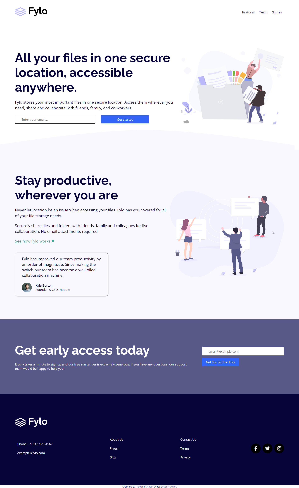

# Frontend Mentor - Fylo landing page with two column layout solution

This is a solution to the [Fylo landing page with two column layout challenge on Frontend Mentor](https://www.frontendmentor.io/challenges/fylo-landing-page-with-two-column-layout-5ca5ef041e82137ec91a50f5). Frontend Mentor challenges help you improve your coding skills by building realistic projects.

## Table of contents

- [The challenge](#the-challenge)
- [Screenshot](#screenshot)
- [Links](#links)
- [Built with](#built-with)
- [What I learned](#what-i-learned)
- [Author](#author)

### The challenge

Users should be able to:

- View the optimal layout for the site depending on their device's screen size
- See hover states for all interactive elements on the page

### Screenshot

### Links

- Solution URL: [Solution link](https://www.frontendmentor.io/solutions/fylo-landing-page-8YR1y_8E9R)
- Live Site URL: [Testimonials Grid section](https://yussif20.github.io/fylo-landing-page/)

### Built with

- Semantic HTML5 markup
- CSS custom properties
- Flexbox
- CSS Grid
- SCSS

### What I learned

It helped me alot in practicing what I learned so far in CSS and it working with SCSS for the first time and see how it can be so useful in organizing the styles

## Author

- Website - [Yusif Ayman](https://yussif20.github.io/main-portfolio/)
- linkedin - [Yusif Ayman](https://www.linkedin.com/in/yussif-ayman/)
- Github - [Yusif Ayman](https://github.com/Yussif20)
- Frontend Mentor - [testimonials-grid-solution](https://www.frontendmentor.io/profile/Yussif20)
